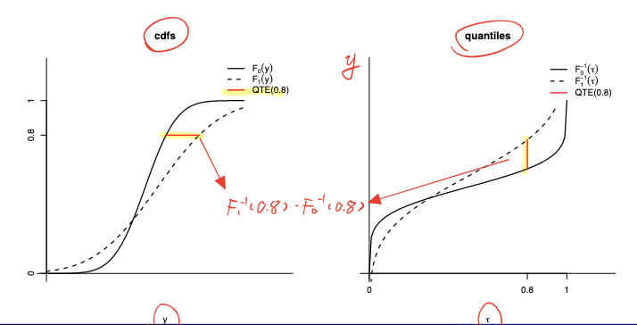

# Week 1: Causal Inference, RCTs, QTE

## Neyman-Rubin Potential Outcome Model

- Treatment Variable:$$D_{i}=\begin{cases}
0 & \text{if i is treated} \\
1 & \text{if i is not treated}
\end{cases}$$
- Potential Outcomes:$$\begin{cases}
Y_{1i} & \text{if } D_{i}=1 \\
Y_{0i} & \text{if } D_{i}=0
\end{cases}$$
- We observe: $$Y_i = D_iY_{1i}+(1-D_i)Y_{0i}$$

## Selections

- **Selection on Levels** ($\leadsto$ **Selection bias**): individuals choose treatment based on level of outcome in absence of treatment$$\mathbb{E}[Y_{0i}|D_i=1]\neq \mathbb{E}[Y_{0i}|D_i=0]$$
- **Selection on Gains** ($\leadsto$ **Heterogenous TE**): individual choose treatment based on gains from treatment$$\mathbb{E}[Y_{1i}-Y_{0i}|D_i=1]\neq \mathbb{E}[Y_{1i}-Y_{0i}|D_i=0]$$
- Example: Roy Model of Occupational Choice

## Treatment Effect and Evaluation Problem

### Treatment Effect for Each Individual

- The **Treatment Effect for Each Individual** is:
$$\beta_i = Y_{1i}-Y_{0i}$$
- Fundamental **“Evaluation Problem”**: either $Y_{0i}$ or $Y_{1i}$ is observed, *never both at the same time* $\leadsto$ cannot observe treatment effect for any individual $\beta_{i}$ directly $\leadsto$ focus on distribution of $\beta_{i}$ instead

### Average Treatment Parameters

- **Average Treatment Effect ATE**: $$\mathbb{E}[\beta_i]=\mathbb{E}[Y_{1i}-Y_{0i}]$$
- **Average Effect of Treatment on the Treated ATT**: $$\mathbb{E}[\beta_i |D_i=1]=\mathbb{E}[Y_{1i}-Y_{0i}|D_i=1]$$
- **Average Effect of Treatment on the Untreated ATU**: $$\mathbb{E}[\beta_i |D_i=0]=\mathbb{E}[Y_{1i}-Y_{0i}|D_i=0]$$
- Comparison of Observed Outcomes in Treatment and Control Group：$$\begin{align*}
\underbrace{\mathbb{E}[Y_i|D_i=1]-\mathbb{E}[Y_i|D_i=0]}_{\text{Observed Difference}} & =\mathbb{E}[Y_{1i}|D_{i}=1]-\mathbb{E}[Y_{0i}|D_{i}=0] \\
 & =\underbrace{\mathbb{E}[Y_{1i}|D_i=1]-\mathbb{E}[Y_{0i}|D_i=1]}_{\text{ATT}}+\underbrace{\mathbb{E}[Y_{0i}|D_i=1]-\mathbb{E}[Y_{0i}|D_i=0]}_{\text{Selection Bias}}
\end{align*}$$

	- Selection on levels $\leadsto$ Bias (Observed difference $\neq$ ATT)

## Randomised Control Trails (RCT)

### Effects

- Randomised Control Trials: RCTs randomly assign individuals into treatment and control group
- Effect of Randomisation: treatment decision is made independent of potential outcomes$$\textcolor{purple}{ D_{i}\perp(Y_{0i},Y_{1i}) }\implies \begin{cases}
\mathbb{E}[Y_{1i}|D_{i}=1]=\mathbb{E}[Y_{1i}|D_{i}=0]=\mathbb{E}[Y_{1i}] \\
\mathbb{E}[Y_{0i}|D_{i}=1]=\mathbb{E}[Y_{0i}|D_{i}=0]=\mathbb{E}[Y_{0i}]
\end{cases}$$

	- $\implies$ **No selection on levels** $$\mathbb{E}[Y_{0i}|D_i=1]= \mathbb{E}[Y_{0i}|D_i=0]=\mathbb{E}[Y_{0i}]$$ 
		- $\implies$ No selection bias (Observed difference = ATT)
	- $\implies$ **No selection on gains** $$\mathbb{E}[Y_{1i}-Y_{0i}|D_i=1]= \mathbb{E}[Y_{1i}-Y_{0i}|D_i=0]=\mathbb{E}[Y_{1i}-Y_{0i}]$$ 
		- $\implies$ (ATT=ATE)

- Observed Differences in RCTs = ATE:$$\begin{align*}
\mathbb{E}[Y_{i}|D_{i}=1]-\mathbb{E}[Y_{i}|D_{i}=0]&=\underbrace{\mathbb{E}[Y_{1i}|D_i=1]-\mathbb{E}[Y_{0i}|D_i=1]}_{\text{ATT}}+\underbrace{\mathbb{E}[Y_{0i}|D_i=1]-\mathbb{E}[Y_{0i}|D_i=0]}_{\text{Selection Bias}=0} \\
&=\underbrace{\mathbb{E}[Y_{1i}|D_i=1]-\mathbb{E}[Y_{0i}|D_i=1]}_{\text{ATT}=\text{ATE}} \\
&=\underbrace{ \mathbb{E}[Y_{1i}]-\mathbb{E}[Y_{0i}] }_{ \text{ATE} }
\end{align*}$$

### Limitations and Caveats of RCTs

- Limitations of RCTs:
	- Small-scale RCTs: 
		- participants not representative
		- possible imbalance across groups (always **test the balance of characteristics**)
		- may miss general equilibrium effects
	- Large-scale RCTs:
		- expensive
		- ethical/political economy concerns
	- Possible **spillovers**
	- RCTs may affect outcomes in a way the actual policy may not, affecting the interpretation and **external validity** (e.g. individuals may choose not to participate when they know they will be subject to randomisation)
	- **Potential selection bias** if randomisation is violated and imperfect compliance
	- RCTs do not always identify actual policy effects due to **absence of selection on gains** (in reality, people optimise their behaviours and there's likely to be selection on gains)

## OLS

- Relationship of Outcome and Treatment Status:$$\begin{align*}
Y_{i} & = D_{i}Y_{1i}-(1-D_{i})Y_{0i} \\
&= Y_{0i} + (Y_{1i}-Y_{0i})D_{i} \\
&= \underbrace{ \mathbb{E}[Y_{0i}] }_{ \equiv\alpha } + \underbrace{ (Y_{1i}-Y_{0i}) }_{ \equiv\beta_{i} }D_{i} + \underbrace{ Y_{0i}-\mathbb{E}[Y_{0i}] }_{ \equiv u_{i} }
\end{align*}$$
	- This looks like a regression except $\beta_{i}$ is random rather than a constant
- **OLS Regression Equation**:$$Y_{i}=\alpha+\beta D_{i}+u_{i}$$where $D_{i}=\mathbb{1}[\text{Treated}]$
	- We can add controls to improve precision
- **OLS Identification** (derived in appendix)$$\begin{split}
\beta_{OLS}&=\underbrace{\mathbb{E}[Y_i|D_i=1]-\mathbb{E}[Y_i|D_i=0]}_{\text{Observed Difference}}\\
&=\underbrace{\mathbb{E}[Y_{1i}|D_i=1]-\mathbb{E}[Y_{0i}|D_i=1]}_{\text{ATT}}+\underbrace{\mathbb{E}[Y_{0i}|D_i=1]-\mathbb{E}[Y_{0i}|D_i=0]}_{\text{Selection Bias}}
\end{split}$$
	- In RCTs: $D_{i}\perp(Y_{0i},Y_{1i})\implies D_{i}\perp (u_{i},\beta_{i})\implies\beta_{OLS}=ATT=ATE$

## Quantile Treatment Effects QTE
- **Quantile Treatment Effects**: change in outcomes at a given quantile $\tau$ before/after treatment:$$QTE_\tau = F_1^{-1}(\tau)-F_0^{-1}(\tau)$$where $F^{-1}(.)$ is the quantile function (inverse of CDF)
- 
- **QTE in RCTs**:
	- RCTs ensure that observed distributions in control/treatment groups are equal to potential outcomes:$$\begin{cases}
F(y|D_{i}=0)=F_{0}(y|D_{i}=0)=F_{0}(y) \\
F(y|D_{i}=1)=F_{1}(y|D_{i}=1)=F_{1}(y)
\end{cases}$$
	- Thus, QTE equals to observed differences in quantiles:$$QTE_\tau = \underbrace{ F^{-1}(\tau|D_i=1)-F^{-1}(\tau|D_i=0) }_{ \text{Observed Difference in Quantiles} }$$
- [[1 Causal Inference, RCTs, QTE - A#^liierym9y9|rank reversals]]: $QTE_{\tau}$ is not necessarily the treatment effect $\beta_{i}$ for individual whose outcome level is at the $\tau$-quantile
- Example
## Appendix
- when ATT = ATE?
- OLS interpretation when regressor is binary
---

# Week 2: Regressions and Matching

## Matching

### Basics
- [[2 PPT Regression and Matching - A#^e39hb70pvcf|Matching Idea]]
- Assume **Selection on Observables**: participation decision depends only on observed characteristics $X_{i}$
- $\implies$ for people with the same characteristics $X_{i}$, the participation decision is random (**Conditional Random Assignment** / RCT for given characteristics):$$\color{purple} (Y_{0i},Y_{1i})\perp D_{i}|X_{i}$$
	- With the same observed characteristics, outcome of individual in the control group provides counterfactual for individual in the treatment group

### Matching Estimand

- Observed difference in outcomes for individuals with characteristics $X_{i}=x$ is:
$$\mathbb{E}[Y_{i}|D_{i}=1,X_{i}=x]-\mathbb{E}[Y_{i}|D_{i}=0,X_{i}=x]$$
- Then, average all observed difference weighted by their probability of occurring
- [[2 PPT Regression and Matching - A#^6y6rjjep04r|Matching Estimand]] for ATE:
$$\beta_M=\int\Big\{\mathbb{E}[Y_i|D_i=1,X_i=x]-\mathbb{E}[Y_i|D_i=0,X_i=x]\Big\}dF_x(x)$$
- Matching Estimand for ATT:$$\beta_M=\int\Big\{\mathbb{E}[Y_i|D_i=1,X_i=x]-\mathbb{E}[Y_i|D_i=0,X_i=x]\Big\}dF_x(x|D_{i}=1)$$

### Assumptions

- **Matching(1)**: [[2 PPT Regression and Matching - A#^5uahq242tuq|Conditional Mean Independence]] / **Unconfoundedness**: for all characteristics $x$:$$\begin{cases}
\mathbb{E}[Y_{0i}|X_i=x,D_i=1]=\mathbb{E}[Y_{0i}|X_i=x,D_i=0]\\
\mathbb{E}[Y_{1i}|X_i=x,D_i=1]=\mathbb{E}[Y_{1i}|X_i=x,D_i=0]\end{cases}$$
	- Weaker than full conditional independence / conditional random assignment
	- No unobservable variables can jointly determine selection and potential outcomes $\iff$ $X$ includes all variables that simultaneously characterise the participation decision and potential outcomes $\iff$ For treated and non-treated individuals with same characteristics $X_{i}$, the participation decision $D_{i}$ does not depend on potential outcomes
	- Rules out selections on unobservables gains: we need $$\mathbb{E}[Y_{1i}-Y_{0i}|X_i=x,D_i=1]=\mathbb{E}[Y_{1i}-Y_{0i}|X_i=x,D_i=0]$$
- **Matching(2)**: [[2 PPT Regression and Matching - A#^yo3f8yhshu|Common Support]]: for all characteristics $x$:$$0<\underbrace{ P(D_i=1|X_i=x) }_{ \text{Propensity Score} }<1$$
	- Every characteristics $X_{i}=x$ occurring in the treatment group also occurs in the control group (otherwise $P(D_{i}=1|X_{i}=x)=1$)
	- Every characteristics $X_{i}=x$ occurring in the control group also occurs in the treatment group (otherwise $P(D_{i}=1|X_{i}=x)=0$)

### Identification

- [[2 PPT Regression and Matching - A#^j75h8mkdj87|Matching Est. Identifies ATE]]:
$$\begin{align}
ATE &=\mathbb{E}[Y_{1i}-Y_{0i}]=\mathbb{E}\Big[\mathbb{E}[Y_{1i}-Y_{0i}|X_{i}]\Big] \tag{LIE}\\
&=\int \Big[ \mathbb{E}[Y_{1i}|X_{i}=x]-\mathbb{E}[Y_{0i}|X_{i}=x] \Big] \, dF_{x}(x) \\
&=\int \Big[ \mathbb{E}[Y_{i}|D_{i}=1,X_{i}=x]-\mathbb{E}[Y_{i}|D_{i}=0X_{i}=x] \Big] \, dF_{x}(x) \tag{Cond. M. Ind. \& CS} \\
&= \beta_{M}
\end{align}$$

### Matching with Discrete Characteristics

- [[2 PPT Regression and Matching - A#^mpb554v0z0d|Matching With Discrete Characteristics]]
- If characteristics are discrete (i.e. there are $k=1,\dots,K$ cells), then matching estimand becomes a weighted sum:$$ATE=\beta_{M}=\sum_{k=1}^K \underbrace{ \Big[ \mathbb{E}[Y_{i}|D_{i}=1,X_{i}=k]-\mathbb{E}[Y_{i}|D_{i}=0,X_{i}=k] \Big] }_{\text{Treatment Effect in Cell k} }\underbrace{ P(X_{i}=k) }_{ \text{Cell Pr} }$$
	- Compute treatment effect in each cell
	- Then, take a linear combination of cell treatment effects weighted by cell probabilities

### Regression as Pesudo-Matching

- [[2 PPT Regression and Matching - A#^lv729n7wuk|Regression as Pseudo-Matching]]
- **Setup** (no constant): $$Y_i =\beta_R D_i + \sum_{k=1}^K \alpha_k \underbrace{ d_{ik} }_{ \text{Cell Dummy} } +\epsilon_i$$where $D_{i}$ is the treatment dummy, $d_{ik}=\mathbb{1}[X_{i}=k]$ is the cell dummy, and $\beta_{R}$ is the regression estimand
	- No interaction terms
- **OLS Identification** $$\beta_R=\sum_{k=1}^K \Big\{\mathbb{E}[Y_i|D_i=1,X_i=k]-\mathbb{E}[Y_i|D_i=0,X_i=k] \Big\}w_k$$where$$w_k=\frac{\overbrace{ P(D_i=1|X_i=k)\left[1-P(D_i=1|X_i=k)\right] }^{ Var(D_{i}|X_{i}=k) }P(X_i=k)}{\sum_{k=1}^K\underbrace{ P(D_i=1|X_i=k)\left[1-P(D_i=1|X_i=k)\right] }_{ Var(D_{i}|X_{i}=k) }P(X_i=k)}$$
- *Matching vs Regression*
	- Regression weights $w_{k}$ depends on the conditional variance of treatment status (balanced cells weight more)
		- this weighting is different from the matching estimand where $w_{k}=Pr(X_{i}=k)$
	- Under Cond. Mean Indep., CS, and **homogenous TE**: $ATE=\beta_M=\beta_R$ (both matching and regression identify ATE)

### Choices of Matching Variables

- [[2 PPT Regression and Matching - A#^eh3c57wregd|Choice of Matching Variables]]
- **Appropriate matching variables**:
	- Simultaneously characterise participation decision (selection) and outcome in the absence of treatment
	- Pre-treatment variables only
- Trade-off between Conditional Mean Indep. and Common Support (too many cells $\leadsto$ more likely for CMI to hold but there may be empty cells (**curse of dimensionality**))

## Propensity Score Matching

- [[2 PPT Regression and Matching - A#^lojgrf7gni9|Curse of Dimensionality and Propensity Score]]
- Definition of **Propensity Score**:$$P(x)\equiv P(D_i=1|X_i=x)$$
- [[2 PPT Regression and Matching - A#^lg63p9onshc|Balancing Property of the Propensity Score]]$$\begin{cases}
Y_{0i}\perp D_i|X_i \implies  Y_{0i}\perp D_i|P(X_i) \\
Y_{1i}\perp D_i|X_i \implies Y_{1i}\perp D_i|P(X_i)
\end{cases}$$
- Disadvantages:
	- This need **full independence**, not just mean independence
	- $P(X)$ is unknown: use a parametric solution (e.g. logit/probit) to estimate propensity scores (avoiding curse of dimensionality)
- Issue: Propensity score is continuous $\implies$ cannot find two individuals with the same propensity score $\leadsto$ need to choose individuals with "similar propensity scores"
	- Nearest neighbour matching (computationally intensive)
	- Kernel matching (computationally intensive)
	- Propensity score re-weighting (simple)
- **Propensity Score Re-Weighting**
	- [[2 PPT Regression and Matching - A#^rtxbtamz0jq|Propensity Score Re-Weighting]]: under **Full Conditional Independence** ($(Y_{1i},Y_{0i})\perp D_{i}|X_{i}$):$$\begin{align}
ATE&=\mathbb{E}[Y_{1i}-Y_{0i}] \\
&= \underbrace{ \mathbb{E}\left[\frac{Y_iD_i}{P(X_i)}\right] }_{ \mathbb{E}[Y_{1i}] } - \underbrace{ \mathbb{E}\left[\frac{Y_i(1-D_i)}{1-P(X_i)}\right] }_{ \mathbb{E}[Y_{0i}] }\\
&=\mathbb{E}\left[\frac{Y_iD_i}{P(X_i)} - \frac{Y_i(1-D_i)}{1-P(X_i)}\right]
\end{align}$$

## Appendix
- [[2 PPT Regression and Matching - A#^09k7lvi42kvq|Integral Notation]]: Let $X$ be a random variable with cdf $F_{X}(x)$. An integral of the form$$\int g(x) \, dF_{X}(x) $$means the following:
	- If $X$ is continuously distributed with pdf $f_{X}(x)$:$$\int g(x) \, dF_{X}(x) =\int g(x)f_{X}(x) \, dx $$
	- If $X$ is discretely distributed with values $\left\{ x_{1},\dots,x_{k} \right\}$:$$\int g(x) \, dF_{X}(x) = \sum_{ k=1 }^{ K } g(x_{k})P(X=x_{k})$$
- [[2 PPT Regression and Matching - A#^52ihuszwbl3|Conditional Independence vs. Mean Independence]]: Independence $\implies$ Conditional Independence; Mean Independence $\implies$ Conditional Mean Independence; all other directions are not true
- [[2 PPT Regression and Matching - A#^poc0ma1pi4p|Regression as Pseudo-Matching]]
- [[2 PPT Regression and Matching - A#^2xxdb5aindh|Deriving the Propensity Score Re-weighting]]

---
# Week 3: Instrumental Variables and Control Functions
## [[3 PPT Instrumental Variables and Control Functions - A]]
### Selection on Unobservables and Endogeneity
- [[3 PPT Instrumental Variables and Control Functions - A#^0ok1itwuys3|Regression and Selection on Unobservables]]:$$\begin{align}
Y_{i}&=D_{i}Y_{1i}+(1-D_{i})Y_{0i} \\
&=Y_{0i}+(Y_{1i}-Y_{0i})D_{i} \\
&=\underbrace{ E[Y_{0i}] }_{ \alpha }+\underbrace{ (Y_{1i}-Y_{0i}) }_{ \beta_{i} }D_{i}+\underbrace{ (Y_{0i}-E[Y_{0i}]) }_{ u_{i} }
\end{align}$$
- **Selection on unobservables**: $Y_{0i}, D_{i}$ have common unobserved factors $\implies$ $Y_{0i}\not\perp D_{i}$ $\implies$ $u_{i}\not\perp D_{i}$
	- $D_{i}$ is **endogenous**: $Cov(D_{i},u_{i})\neq 0$
	- OLS estimator of $\beta$ is biased and inconsistent
### IV with Homogeneous Treatment Effect
- [[3 PPT Instrumental Variables and Control Functions - A#^x83p44qunr|IV: Basic Idea]]
- [[3 PPT Instrumental Variables and Control Functions - A#^h1y04tthrsp|IV Assumptions]]
	- **Exclusion**: $Cov(Z_i, u_i)=0$ (untestable)
	- **Relevance**: $Cov(Z_{i},D_{i})\neq 0$
		- In 1st stage regression ($D_{i}=\pi_{0}+\pi_{1}Z_{i}+v_{i}$), $\pi_1 =\frac{Cov(Z_i,D_i)}{Var(Z_i)}\neq 0$, we can test this
- [[3 PPT Instrumental Variables and Control Functions - A#^oj0eywgb1e|Identification]]
	- **First-stage** regression ($D_{i}$ on $Z_{i}$): $$D_{i}=\pi_{0}+\pi_{1} Z_{i}+v_{i}$$
	- **Second-stage** regression ($Y_{i}$ on $D_{i}$): $$Y_{i}=\alpha+\beta D_{i}+u_{i}$$
	- **Reduced-form*** regression ($Y_{i}$ on $Z_{i}$): $$Y_{i}=\alpha+\beta \pi_{0}+\beta \pi_{1}Z_{i}+u_{i}+\beta v_{i}$$
		- $$\implies Cov(Y_{i},Z_{i})=\beta Cov(D_{i},Z_{i})+\underbrace{ Cov(u_{i},Z_{i}) }_{ =0 \text{ by exclusion}}$$
- [[3 PPT Instrumental Variables and Control Functions - A#^6i34d61jmgp|Identification of ATE and ATT]] (by relevance):$$\beta_{IV}=\underbrace{ \frac{\frac{Cov(Y_{i},Z_{i})}{Var(Z_{i})}}{\frac{Cov(D_{i},Z_{i})}{Var(Z_{i})}} }_{ \text{Reduced-Fm / 1st Stage} }=\frac{Cov(Y_{i},Z_{i})}{Cov(D_{i},Z_{i})}\underbrace{ =\beta=ATE=ATT }_{ \text{Under Homogeneous TE} }$$
- [[3 PPT Instrumental Variables and Control Functions - A#^7kbzf2hma2e|Binary IV: Wald Estimand]]: when IV is *binary*:$$\beta_{Wald}=\frac{\mathbb{E}[Y_i|Z_i=1]-\mathbb{E}[Y_i|Z_i=0]}{\mathbb{E}[D_i|Z_i=1]-\mathbb{E}[D_i|Z_i=0]}=\beta$$
### IV With Heterogeneous Treatment Effects
- Heterogeneous treatment effects: $\beta_{i}$ varies across $i$ 
- [[3 PPT Instrumental Variables and Control Functions - A#^wx1lxv8zjja|Potential Treatment Indicators and Potential Outcomes]]
	- Treatment: $D_{Z_{i},i}$
	- Potential outcomes: $Y_{D_{i},Z_{i},i}$
#### 4 Assumptions
- [[3 PPT Instrumental Variables and Control Functions - A#^uzb1qg5mul8|Independence]] (*random assignment of IV*): $$(Y_{11i},Y_{10i},Y_{01i},Y_{00i},D_{1i},D_{0i})\perp Z_i$$
	- Implication: we can estimate causal effects of $Z_{i}$ on $D_{i}$ and $Z_{i}$ on $Y_{i}$ as in RCTs
- [[3 PPT Instrumental Variables and Control Functions - A#^uru8quyrhjr|Exclusion]] (*IV does not directly influence potential outcomes*): $$\begin{cases}
Y_{11i}=Y_{10i}=Y_{1i}\\Y_{01i}=Y_{00i}=Y_{0i}
\end{cases}$$
	- Implication: we have the usual expression for observed outcomes: $$Y_{i}=D_{i}Y_{1i}+(1-D_{i})Y_{0i}=\underbrace{ \mathbb{E}[Y_{0i}] }_{ \alpha }+(\underbrace{ Y_{1i}-Y_{0i} }_{ \beta })D_{i}+(\underbrace{ Y_{0i}-\mathbb{E}[Y_{0i}] }_{ u_{i} })$$
- [[3 PPT Instrumental Variables and Control Functions - A#^1cll09iwlm5|Monotonicity]] (*No defiers*): increasing IV may induce some untreated individuals to take treatment, but cannot induce any treated individuals to leave treatment:$$D_{1i}\geq D_{0i}\ \forall\ i$$
- [[3 PPT Instrumental Variables and Control Functions - A#^hu3bnk7c0cs|Relevance]] (*IV induces variation in the treatment*): IV needs to induce variations in treatment indicator:$$\mathbb{E}[D_{1i}-D_{0i}]\neq 0$$
	- This is satisfied if individuals with $Z_{i}=1$ are more likely to participate:$$P(D_{1i}=1)=\mathbb{E}[D_{1i}]>\mathbb{E}[D_{0i}]=P(D_{0i}=1)$$
#### LATE
- [[3 PPT Instrumental Variables and Control Functions - A#^0m36376i76pi|Reactive Subpopulations]]
	- Always takers $D_{1i}=D_{0i}=1$
	- Never takers $D_{1i}=D_{0i}=0$
	- Compliers $D_{1i}=1, D_{0i}=0$
	- Defiers $D_{1i}=0, D_{0i}=1$
- Wald Estimator identifies **Local Average Treatment Effect (LATE)**
	- [[3 PPT Instrumental Variables and Control Functions - A#^bxjz4bziyu|Reduced Form]]:$$\mathbb{E}[Y_{i}|Z_{i}=1]-\mathbb{E}[Y_{i}|Z_{i}=0]=\mathbb{E}[Y_{1i}-Y_{0i}|D_{1i}>D_{0i}]P(D_{1i}>D_{0i})$$
	- [[3 PPT Instrumental Variables and Control Functions - A#^788z17hx9v2|First Stage]]:$$\mathbb{E}[D_{i}|Z_{i}=1]-\mathbb{E}[D_{i}|Z_{i}=0]=P(D_{1i}>D_{0i})$$
	- [[3 PPT Instrumental Variables and Control Functions - A#^7d5lun494ps|Reduced Form Divided by First Stage]]
	- [[3 PPT Instrumental Variables and Control Functions - A#^ooruh6dv25e|Local Average Treatment Effect (LATE)]] Identification:$$\begin{align}
\beta_{Wald}&=\frac{\mathbb{E}[Y_{i}|Z_{i}=1]-\mathbb{E}[Y_{i}|Z_{i}=0]}{\mathbb{E}[D_{i}|Z_{i}=1]-\mathbb{E}[D_{i}|Z_{i}=0]} \\
&=\frac{\mathbb{E}[Y_{1i}-Y_{0i}|D_{1i}-D_{0i}]P(D_{1i}>D_{0i})}{P(D_{1i}>D_{0i})} \\
&=\underbrace{ \mathbb{E}[Y_{1i}-Y_{0i}|D_{1i}>D_{0i}] }_{ \text{LATE} }
\end{align}$$
- [[3 PPT Instrumental Variables and Control Functions - A#^vjx7b143b8c|Interpretation of LATE]]: $$\color{purple} LATE \equiv \mathbb{E}[Y_{1i}-Y_{0i}|D_{1i}>D_{0i}]$$is the average treatment effect for those who are induced to take the treatment when the IV is increased (**treatment effect for the compliers only**)
	- *Under independence + exclusion + monotonicity + relevance, Wald Estimand identifies LATE*:$$\beta_{Wald}=LATE\ \begin{cases}=ATE=ATT & \text{if Homogeous TE}\\\neq ATE\ or\ ATT & \text{if Heterogenous TE}  \end{cases} $$
		- LATE is a **local effect** (only in complier group)
		- different instruments identify different LATE (we need policy relevant instrument)
- [[3 PPT Instrumental Variables and Control Functions - A#^cr0l69aagy|LATE With Variable Treatment Intensity]]
	- If treatment indicators $D_{0i},D_{1i}$ can take on multiple values $\{ 0,1,\dots,\bar{d} \}$
	- Under independence + exclusion + monotonicity + relevance, Wald est. identifies a **weighted average of causal effects**$$\beta_{Wald}= \sum_{d=1}^{\bar{d}} w_d\ \mathbb{E}[Y_{di}-Y_{(d-1)i}|D_{1i}\geq d>D_{0i}]$$where the weights are$$w_d = \frac{P(D_{1i}\geq d>D_{0i})}{\sum_{j=1}^\bar{d}P(D_{1i}\geq j>D_{0i})}$$
- [[3 PPT Instrumental Variables and Control Functions - A#^0xlyvjm3fbad|LATE Interpretation]]
- [[3 PPT Instrumental Variables and Control Functions - A#^uexpswye7oo|Practical Advice for Using LATE]]
	- **Motivate IV**
		- Motivate IV validity (relevance + exclusion)
		- Placebo test on outcomes that should not be affected by IV
		- Control variables (exclusion more likely to valid; LATE interpretation more complex)
		- Who are the compilers? (is the instrument policy relevant?)
	- **Check IV**
		- Always report 1st-stage est. (ideally $F>104.7$)
		- Inspect reduced form estimates
- *PS1:1.d when LATE=ATE?*
### Control Function Methods
- Idea: specify the exact nature of dependence between observables and unobservables (explicitly model and control for potential selection bias)
#### Heckman Selection Model
- Outcome:$$Y_{i}=\begin{cases}
\beta^\intercal X_{i}+u_{i}, &\text{if } D_{i}=1 \\
\text{unobserved}, &\text{if } D_{i}=0
\end{cases}$$with $E[u_{i}|X_{i},Z_{i}]=0$
- Selection: $D_{i}=1[\gamma^\intercal Z_{i}+v_{i}\geq 0]$
- Further assumptions:
	- $X_{i}$ is a strict sub-vector of $Z_{i}$ 
	- $Z_{i}\perp(u_{i},v_{i})$
- **Additional distributional assumption**:
	- $(u_{i},v_{i})\sim\mathcal{I}\left( 0, \begin{pmatrix} \sigma_{u}^2 & \sigma_{uv} \\ \sigma_{uv} & \sigma_{v}^2\end{pmatrix} \right)$
- Under all those assumptions:$$E[Y_{i}|Z_{i},D_{i}=1]=\beta^\intercal X_{i}+\rho E[v|D_{i}=1]=\beta^\intercal X_{i}+\rho \lambda(\gamma^\intercal Z_{i})$$where $\rho$ is the correlation between $u_{i},v_{i}$ and $\lambda(\gamma^TZ_{i})$ is the Inverse Mill's Ratio
- **Estimation**
	- Step 1 (Logit/Probit on the whole sample)$$Pr(D_i=1|Z_i)=\Phi(\gamma^\intercal Z_i)$$
	- Step 2 (Main Regression)$$E[Y_i|Z_i,D_i=1]=\beta^\intercal X_i +\rho\underbrace{\lambda(\hat{\gamma}^\intercal Z_i)}_{\text{Inverse Mill's Ratio}}$$
- Caveats
	- SE needs to be adjusted to account for the 1st step estimation of $\gamma$
	- Strictly speaking, we can have $X_{i}=Z_{i}$ because $\lambda(.)$ is a non-linear function, but it's very similar to a linear function, so having more variables in $Z_{i}$ prevents such issue
#### (Generalised) Control Functions for Selections on Unobservables and ATE
- More flexible setup: *no distributional assumption*
- **Model**: 
	- Outcome:$$Y_{i}=\underbrace{ \alpha }_{ E[Y_{0i}] }+\underbrace{ \beta_{i} }_{ Y_{1i}-Y_{0i} }D_{i}+\underbrace{ u_{i} }_{ Y_{0i}-E[Y_{0i}] }$$
	- Selection: $D_{i}=\mathbb{1}[\gamma^\intercal Z_{i}+v_{Di}\geq 0]$
	- Further assumption:
		- **Exogeneity**: $(Y_{0i},Y_{1i},v_{Di})\perp Z_{i}$
			- This allows $(Y_{0i},Y_{1i})\not\perp v_{Di} \implies (Y_{0i},Y_{1i})\not\perp D_{i}$ even condition on $Z_{i}$, so there is endogeneity and we cannot use matching
		- **Relevance**: $Z_{i}$ induces changes in $D_{i}$
		- $X_{i}$ is a strict sub-vector of $Z_{i}$
- This implies:$$\begin{cases}
\mathbb{E}[Y_{i}|Z_{i},D_{i}=1]=\alpha+ATE+K_{1}(P(Z_{i})) \\
\mathbb{E}[Y_{i}|Z_{i},D_{i}=0]=\alpha+K_{0}(P(Z_{i}))
\end{cases}$$where $K_{1}(P(Z_{i}))=const. \times\frac{\phi(\Phi^{-1}(1-P(Z_{i})))}{1-\Phi(\Phi^{-1}(1-P(Z_{i})))}$ and $K_{0}(P(Z_{i}))$ can be constructed similarly, and we can retrieve ATE accordingly
---
# Week 4: Repeated Cross-Sections and Panel Data
## [[4 Repeated Cross-Sections and Panel Data - A]]
- [[4 Repeated Cross-Sections and Panel Data - A#^ln9q1a1o5u8|Before/After Analysis]]
	- **Natural Experiment**: a policy shift that affects one part of the population, but not another
- [[4 Repeated Cross-Sections and Panel Data - A#^l4pxgh7pdq|Potential Outcomes]]
	- Notation: $Y_{D_{it},it}$
	- In period 1: $Y_{0,i1}$
	- In period 2: $\begin{cases}Y_{0,i2}, & if\ D_{i2}=0\\Y_{1,i2}, & if\ D_{i2}=1\end{cases}$
	- Observed outcome in period t$$Y_{it}=D_{it}Y_{1,it}+(1-D_{it})Y_{0,it}=D_{it}(Y_{1,it}-Y_{0,it})+Y_{0,it}$$
	- Object of interest: $ATT=\mathbb{E}[Y_{1,i2}-Y_{0,i2}|D_{i2}=1]$
- [[4 Repeated Cross-Sections and Panel Data - A#^vn6k5t9bxud|No-Trends Assumption]]
	- If $$\mathbb{E}[Y_{0,i2}|D_{i2}=1]=\mathbb{E}[Y_{0,i1}|D_{i2}=1]$$ then FD identifies ATT:$\mathbb{E}[Y_{i2}-Y_{i2}|D_{i2}=1]=\underbrace{ \mathbb{E}[Y_{1,i2}-Y_{0,i2}|D_{i2}=1] }_{ ATT }$
- [[4 Repeated Cross-Sections and Panel Data - A#^hwef57smzld|First Differences]]
### Difference in Difference
#### Common Trend Assumption
- [[4 Repeated Cross-Sections and Panel Data - A#^gfh4rdgxrhb|Common Trend Assumption]]: in absence of treatment, the changes in outcomes in control/treatment groups are the same:$$\color{purple} \mathbb{E}[Y_{0,i2}-Y_{0,i1}|D_{i2}=1]=\mathbb{E}[Y_{0,i2}-Y_{0,i1}|D_{i2}=0]$$
	- Allows for
		- Selection on non-treatment levels: $\mathbb{E}[Y_{0,it}|D_{i2}=1]\neq \mathbb{E}[Y_{0,it}|D_{i2}=0],\ for\ t=1,2$
		- Selection on gains (our objective of interest is ATT anyway): $\mathbb{E}[Y_{1,i2}-Y_{0,i2}|D_{i2}=1]\neq \mathbb{E}[Y_{1,i2}-Y_{0,i2}|D_{i2}=0]$
		- Individual-specific and time-invariant unobservables
#### DiD Estimand and Identification
- [[4 Repeated Cross-Sections and Panel Data - A#^306bqwukfw5|Difference-in-Differences]]
- Difference in the treatment group:
$$\begin{align}
\mathbb{E}[Y_{i2}-Y_{i1}|D_{i2}=1] & = \mathbb{E}[D_{i2}(Y_{1,i2}-Y_{0,i2})+Y_{0,i2}-Y_{0,i1}|D_{i2}=1] \\
&= \underbrace{ \mathbb{E}[Y_{1,i2}-Y_{0,i2}|D_{i2}=1] }_{ \text{ATT} } + \underbrace{ \mathbb{E}[Y_{0,i2}-Y_{0,i1}|D_{i2}=1] }_{ \text{Trend for the Treated} }
\end{align}$$
- Difference in the control group:
$$\begin{align}
\mathbb{E}[Y_{i2}-Y_{i1}|D_{i2}=1] & = \mathbb{E}[D_{i2}(Y_{1,i2}-Y_{0,i2})+Y_{0,i2}-Y_{0,i1}|D_{i2}=0] \\
&= \underbrace{ \mathbb{E}[Y_{0,i2}-Y_{0,i1}|D_{i2}=0] }_{ \text{Trend for the Control} }
\end{align}$$
- **DiD Estimand** identifies ATT under common trend assumption:$$\color{red} \beta_{DiD}=\underbrace{ \mathbb{E}[Y_{i2}-Y_{i1}|D_{i2}=1] }_{ \text{Diff. in Treatment Group} }-\underbrace{ \mathbb{E}[Y_{i2}-Y_{i1}|D_{i2}=0] }_{ \text{Diff. in Control Group} }=\underbrace{\mathbb{E}[Y_{1,i2}-Y_{0,i2}|D_{i2}=1]}_{ATT}$$
#### DiD as Regression
- [[4 Repeated Cross-Sections and Panel Data - A#^yff2er9supb|DiD As Regression]]:$$Y_{it}=\beta_0 +\beta_1 treat_i+\beta_2after_t+\beta_3treat_i\times after_t+u_{it}$$where $\beta_3$ is the DiD estimator![[Pasted image 20230518203352.png]]
	- *Advantage*:
		- easy to compute SE (allows for serial correlations in $U_{it}$ or clustered SE)
		- easy to add more covariates (to control for confounding trends / increase precision)
	- *Disadvantage*:
		- this identifies ATT only when ATT is homogenous, otherwise (e.g. when the policy implementation is staggered) it identifies a complex weighted average
#### Main Fails of Common Trend
- **Main Fails of Common Trends Assumption**
	- [[4 Repeated Cross-Sections and Panel Data - A#^85c9ycetguy|Differential Macroeconomic Trends]]
		- always check pre-treatment trends
	- [[4 Repeated Cross-Sections and Panel Data - A#^fer30tjm5ip|Composition Effects]]: treatment may change the composition of the groups
		- We can **redefine** groups such that compositions are not affected by treatment, but the TE we identify will be **Intention to Treat (ITT)** instead of ATT
	- Idiosyncratic temporary shocks (e.g. [[4 Repeated Cross-Sections and Panel Data - A#^694fyo8kctx|Ashenfelter’s Dip]]): enrolment is more likely when a temporary dip in earnings occurs just before the programme starts -- faster earnings growth expected even in absence of the programme
#### Policy Shift Level
- [[4 Repeated Cross-Sections and Panel Data - A#^mdjjnqah4b|Aggregate Policy Shift]]
	- If policy shift happens on *aggregate level*, we only need repeated cross-sections:$$Y_{\textcolor{ red }{ ist }}=\beta_0 +\beta_1 treat_\textcolor{ red }{ s }+\beta_2after_t+\beta_3treat_\textcolor{ red }{ s }\times after_t+u_{\textcolor{ red }{ ist }}$$
	- If policy shift happens on *individual level*, we will need panel data:$$Y_{\textcolor{ red }{ it }}=\beta_0 +\beta_1 treat_\textcolor{ red }{ i }+\beta_2after_t+\beta_3treat_\textcolor{ red }{ i }\times after_t+u_{\textcolor{ red }{ it }}$$
### Quantile DiD and Quantile CiC
- [[4 Repeated Cross-Sections and Panel Data - A#^a427jsp2arp|DiD and Quantile Treatment Effects]]
- Use non-linear DiD to estimate QTE
- [[4 Repeated Cross-Sections and Panel Data - A#^x67nnk8xzo|Quantile DiD]]$$\text{Quantile DiD}=\underbrace{[F_2^{-1}(\tau)-F_1^{-1}(\tau)|D_{i2}=1]}_{QTE_1} - \underbrace{[F_2^{-1}(\tau)-F_1^{-1}(\tau)|D_{i2}=0]}_{QTE_0}$$
	- Steps:
		- Fix quantile level $\tau$
		- Compute QTEs at $\tau$ for the treatment ($QTE_{1}$) and control ($QTE_{0}$)
		- Take difference: $QTE_{1}-QTE_{0}$
	- This requires **common trend at the fixed quantile level $\tau$**
	- ![[Pasted image 20230411214639.png]]
- [[4 Repeated Cross-Sections and Panel Data - A#^wzm6fdrnm3n|Quantile CiC]]$$\text{Quantile CiC}=\underbrace{[F_2^{-1}(\tau_1)-F_1^{-1}(\tau_1)|D_{i2}=1]}_{QTE_1} - \underbrace{[F_2^{-1}(\tau_0)-F_1^{-1}(\tau_0)|D_{i2}=0]}_{QTE_0}$$where $\tau_1, \tau_0$ is the quantile corresponding to a given $y_0$ in the treatment/control group in t=0 respectively
	- Steps:
		- Fix $y$ at $y_{0}$, find its corresponding quantile in treatment ($\tau_{1}$) and control ($\tau_{0}$)
		- Compute QTE at $\tau_{1}$ for the treatment ($QTE_{1}$) and  QTE at $\tau_{0}$ for the control ($QTE_{0}$)
		- Take difference: $QTE_{1}-QTE_{0}$
	-  This requires **common trend at a fixed initial $y_{0}$**
	- ![[Pasted image 20230411214650.png]]
---
# Week 10: Regression Discontinuity Designs
## [[10 RDD - A]]
- [[10 RDD - A#^fgx3j9mtnt7|Regression Discontinuity (RD) Design]]: $D_{i}$ is assigned based on whether some "running variable" $A_{i}$ is above/below a cutoff $c$
### Sharp RD
#### Treatment Assignment
- [[10 RDD - A#^w814fs9knci|Sharp RD: Treatment Assignment]]: Treatment $D_{i}$ is a *deterministic* function of $A_{i}$:$$D_{i}=\begin{cases}
1, &if\ A_{i} \geq c \\
0, &if\ A_{i}<c
\end{cases}$$
- [[10 RDD - A#^tdpmbs3iyc|Extrapolation]]: we cannot perform matching on $A_{i}$ because there is *no common support*: only $Y_{1i}$ is observed if $A_{i}\geq c$ and only $Y_{0i}$ is observed if $A_{i}<c$. We need to *extrapolate* potential outcomes' dependence on $A_{i}$ outside of group![[Pasted image 20221219194947.png]]
#### Continuity Assumption
- [[10 RDD - A#^afv8wji4htn|Continuity Assumption]]: $\mathbb{E}[Y_{1}|A_{i}=a]$ and $\mathbb{E}[Y_{0}|A_{i}=a]$ are **continuous** functions of $a$ at cutoff $c$.
- This *requires*:
	- $D_{i}$ jumps at $A_{i}=c$
	- All factors determining $Y_{1i}, Y_{0i}$ change continuously around $c$
	- **No manipulation** of $A_{i}$ near the cutoff (individuals cannot precisely control $A_{i}$ near the cutoff to intentionally get treated or not) $\implies$ the distribution of $A_{i}$ should be continuous at $c$
- This *implies*:
	- Variation in treatment $D_{i}$ near the cut-off is random (**Conditional Random Assignment / Local RCT**)
		- Predetermined characteristics $X_{i}$ should have the same distribution just to the left/right of the cutoff
	- We can use outcomes of individuals just to the left of $c$ as counter-factual for individuals just to the right of $c$
- Check by **McCrary Test**: 
	- Check **continuity of the density of the running variable at the cutoff** to examine manipulation
	- Check **continuity of other characteristics at the cutoff** to exclude the possibility that the change in outcome is caused by them
	- It is not a formal test for the continuity assumption: even if those observed characteristics are continuous at the cutoff, they do not imply the continuity assumption is satisfied (there could be unobserved variables that affect $Y_{1i},Y_{0i}$ and jump at the cutoff)
#### Sharp RD Estimand and Treatment Effect
- **Sharp RD Estimand**:$$\color{purple} \beta_{SD}=\lim_{\epsilon \downarrow 0} \Big\{ \mathbb{E}[Y_{i}|A_{i}=c+\epsilon]-\mathbb{E}[Y_{i}|A_{i}=c-\epsilon] \Big\}$$
- Under continuity assumption, Sharp RD estimand identifies **TE as the cutoff** $c$:$$\beta_{SD}=\mathbb{E}[Y_{1i}-Y_{0i}|A_{i}=c]$$
	- If TE is homogenous, then $\beta_{SD}=ATE=ATT$
#### Implementation
- [[10 RDD - A#^e3zkxwnwor9|Implementation]]
- **Steps**:
1. Specify 2 regression models for either side of the cutoff:$$\begin{cases}
Y_{i}=\alpha_{i}+f_{l}(c-A_{i})+\epsilon_{li}, &if\ A_{i}<c \\
Y_{i}=\alpha_{r}+f_{r}(A_{i}-c)+\epsilon_{ri}, &if\ A_{i}\geq c
\end{cases}$$where $f_{r}(.),f_{l}(.)$ are some functions with $f_{r}(0)=0,f_{l}(0)=0$
2. Estimate $\alpha_{l},\alpha_{r}$
3. RD Estimand: $\beta_{RD}=\alpha_{r}-\alpha_{l}$
- *Key choice*:
	- Specification of $f_{r}(.),f_{l}(.)$
	- Choice of **bandwidth**: how far away from the cutoff do we use data?
- **Regression Specifications**
	- [[10 RDD - A#^cpc0s7en7o|Regression Specifications]]
	- **Ideal local randomised experiment**: $Y_{i}\perp A_{i}$ on either side of the cutoff:$$\begin{cases}
Y_{i}=\alpha_{i}+\epsilon_{li}, &if\ A_{i}<c \\
Y_{i}=\alpha_{r}+\epsilon_{ri}, &if\ A_{i}\geq c
\end{cases}$$
	- **Smoothly contaminated local randomised experiment**: $Y_{i}$ depends on $A_{i}$ at either side of the cutoff
		- We then need to choose a linear slope, quadratic slope,..., or a Non-parametric function
### Fuzzy RD
#### Setup
- [[10 RDD - A#^cy6966sm12k|Fuzzy RD Design]]
- Treatment $D_{i}$ is still random given a value of $A_{i}$, but the probability of treatment given $A_{i}$ jumps at cutoff $c$:$$\lim_{\epsilon\downarrow 0} P(D_{i}=1|A_{i}=c+\epsilon )\neq \lim_{\epsilon\downarrow 0} P(D_{i}=1|A_{i}=c-\epsilon )$$
	- Sharp RD is a special case of Fuzzy RD where the probability jumps from 0 to 1
#### Estimand
- [[10 RDD - A#^phcvqjb9a4|Fuzzy RD Estimand]]:$$\color{purple} \beta_{FD}=\frac{\lim_{\epsilon \downarrow 0} \Big\{ \mathbb{E}[Y_{i}|A_{i}=c+\epsilon]-\mathbb{E}[Y_{i}|A_{i}=c-\epsilon] \Big\}}{\lim_{\epsilon \downarrow 0} \Big\{ P[D_{i}=1|A_{i}=c+\epsilon]-P[D_{i}=1|A_{i}=c-\epsilon] \Big\}}$$
#### Fuzzy RD as IV
- [[10 RDD - A#^z1dqe9bfwjl|Fuzzy RD as IV]]: Fuzzy RD can be interpreted as IV near the cutoff
- Instrument:$$Z_{i}=\begin{cases}
1, &if\ A_{i}\geq c \\
0, &if\ A_{i}<c
\end{cases}$$
- Potential treatment:$$D_{i}=\begin{cases}
D_{1i}, &if\ Z_{i}=1 \\
D_{0i}, &if\ Z_{i}=0
\end{cases}$$
- For small $\epsilon>0$, RD estimand can be *understood as a Wald estimand*, and identifies **LATE**:$$\begin{split}
\beta_{FD}&\approx\frac{\mathbb{E}[Y_{i}|A_{i}=c+\epsilon]-\mathbb{E}[Y_{i}|A_{i}=c-\epsilon]}{P[D_{i}=1|A_{i}=c+\epsilon]-P[D_{i}=1|A_{i}=c-\epsilon]}\\
&=\frac{\mathbb{E}[Y_{i}|Z_{i}=1]-\mathbb{E}[Y_{i}|Z_{i}=0]}{\mathbb{E}[D_{i}|Z_{i}=1]-\mathbb{E}[D_{i}|Z_{i}=0]}\\
&=\mathbb{E}[Y_{1i}-Y_{0i}|D_{1i}>D_{0i}]
\end{split}$$
- Interpretation as LATE:
	- Local: ATE for people who are 
		- *At the cutoff* ($A_{i}=c$) 
		- *Switch to treatment at the cutoff (compliers)*
			- Here, compliers are individuals who would not participate if $c$ is just above $A_{i}$, but would participate if $c$ is just below $A_{i}$
### Practical Advice
- Motivate the validity of design -- why individuals cannot manipulate assignment variable $A_{i}$?
- Test validity of design -- check continuity of outcomes, covariates, and density of $A_{i}$ around the cutoff
- Show robustness of RD estimates with respect to specification of $f_{r}(.),f_{l}(.)$ and choice of bandwidth
---
# Others
- [[ECON0021 Week 7 Question]]
- **Estimand** is a population concept; **Estimator** is its finite sample analogue
- **Inverse of a $2\times2$ matrix**:$$\begin{bmatrix}
a & b \\
c & d
\end{bmatrix}^{-1}=\frac{1}{ad-bc}\begin{bmatrix}
d & -b \\
-c & a
\end{bmatrix}$$
- **Statistical independence**:$$\begin{split}
A\perp B &\Leftrightarrow F_{A|B}(a|b)=F_{A}(a) \\
&\Leftrightarrow Pr(A<a|b)=Pr(A<a)\\
&\Leftrightarrow P(A=a,B=b)=P(A=a)P(B=b)\\
&\Leftrightarrow F_{AB}(a,b)=F_{a}(a)F_{B}(b)\\
&\Leftrightarrow f_{AB}(a,b)=f_{A}(a)f_{B}(b)
\end{split}$$
- **Conditional Expectation**:$$E[A|B]=\int_{-\infty}^{\infty} af_{A|B}(a|b) \, da $$and $f_{A|B}(a|b)=\frac{f_{A,B}(a,b)}{f_{B}(b)}$
- **Central Limit Theorem**: Let $X_{i},i=1,\dots,n$ are random samples independently drawn from a distribution with mean $\mu$ and variance $\sigma^2$. Let $\bar{X}_{n}=\frac{1}{n}\sum_{i=1}^n X_{i}$ be the sample average, then as $n\rightarrow\infty$: $$\sqrt{ n }(\bar{X}_{n}-\mu)\sim^d\mathcal{N}(0,\sigma^2)$$
- **Confidence Interval** (95%): $$\left[ -1.96\frac{\sigma}{\sqrt{ n }}+\bar{X}_{n} < \mu < 1.96\frac{\sigma}{\sqrt{ n }}+\bar{X}_{n} \right]$$
- **OLS Estimand in Matrices**:$$\beta=E[X'X]^{-1}E[X'Y]$$
- **OLS Estimator in Matrices**:$$\hat{\beta}=\left( \sum_{i=1}^n X_{i}X_{i}' \right)^{-1}\left( \sum_{i=1}^n X_{i}Y_{i} \right)$$
- **pdf of $\mathcal{N}(0,\sigma^2)$**:$$f_{X}(x)=\frac{1}{\sqrt{ 2\pi \sigma^2 }}\exp(-\frac{x^2}{2\sigma^2})$$
- **Chain Rule for Vectors**$$\frac{\partial}{\partial\beta}F(x^\intercal\beta)=xF'(x^\intercal\beta); \frac{\partial}{\partial\beta^T}F(x^\intercal\beta)=x^\intercal F'(x^\intercal \beta)$$
- **Jensen Inequality**
	- For $f(x)=x^2$, we have a nice proof:$Var(X)=E[X^2] - (E[X])^2>0\implies E[X^2]>(E[X])^2$
---
# Revisions
- pdf of continuous distributed variable:$$f_{x}(x)=Pr(x \in (x-\epsilon,x+\epsilon)))$$
- conditional to unconditional pdf$$Pr(X|Y)= \frac{Pr(X,Y)}{Pr(Y)} \leadsto  (\text{apply to cdf and pdf})$$
- expectation as integrals$$\mathbb{E}[X]=\begin{cases}
\sum_{k} k\cdot Pr(X=k) & \text{for discrete X} \\
\to \int k\cdot f_{X}(x=k) \, dx  & \text{as } k\to \infty \text{ for continuous X}
\end{cases}$$
- conditional expectations$$\mathbb{E}[X|Y]= \int kf_{X}(x=k) \, dk $$
- LIE in integrals$$\mathbb{E}[X]= \mathbb{E}[\mathbb{E}[X|Y]]= \int \int xf_{X|Y}(k|y) \, dx f_{Y} \, dy $$
- *make brief explanations of the steps*
- *make a cheatsheet of the full MLE workflow of possible distributions*
- MLE: sample likelihood -> take log -> FOC with respect to parameters -> score -> Hessian -> asymp Var
- Asymptotic var:$$AsympVar(X)= \sqrt{ n }\cdot Var(x)$$
